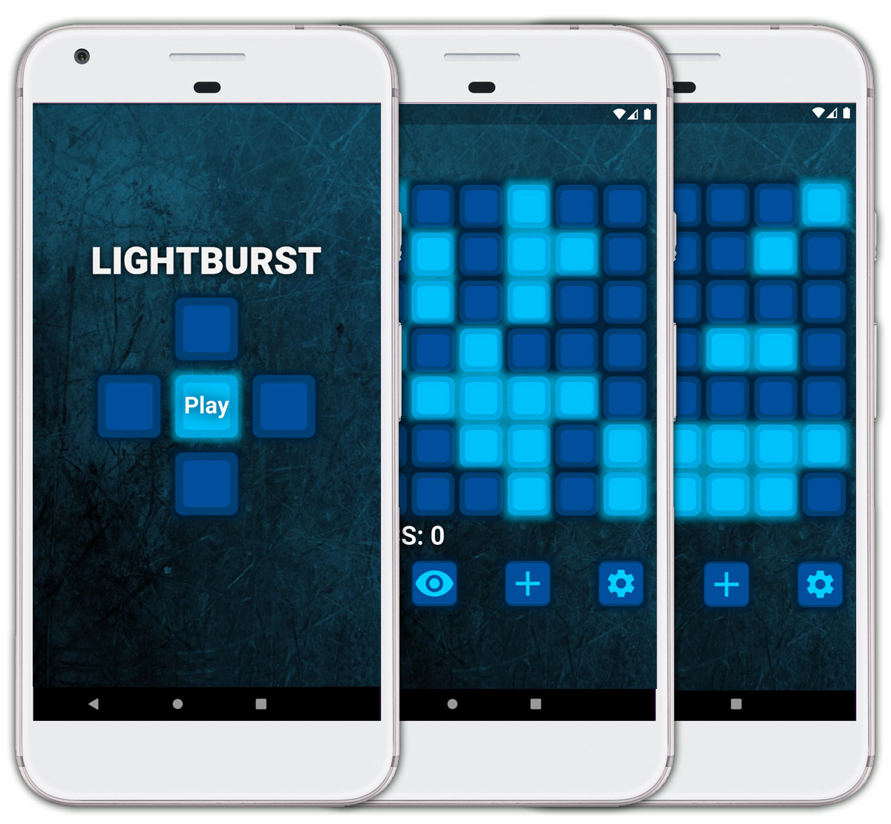

# LightBurst
a puzzle game - the object of the game is to turn all the lights off


# Table of contents
1. [Installation](#Installation)
2. [Usage Rights](#UsageRights)
3. [Features](#Features)
5. [Technology](#Technology)
6. [Credits](#Credits)
<a name="Installation"></a>
## Installation
```sh
Use a mobile emulator from your IDE.
```

<a name='Usage Rights / License'></a>
## Usage Rights / License
This game and the related code are copyrighted (c) by Bart Dority, 2021, all rights are reserved.  Please contact bartdority@gmail.com if you would like to use any part of this code or concepts.  

<a name="Features"></a>
## Features
1. platform independent
2.  mobile
3.  fun
<a name="Technology"></a>
## Technology
1. Flutter
2.  Dart
<a name="Credits"></a>
## Credits
Bart Dority

**on github:** <a href='github.com/b0rgBart3'>b0rgBart3</a>

[](https://github.com/remarkablemark)

Email: borgBart3@gmail.com
